# 🗺️ PROD'AI LAB — Master Map
*Cartographie visuelle exhaustive du projet, construite **uniquement** à partir des fichiers existants du dossier `Studio IA/` (00→07 + Brand), lus intégralement. Aucune réinterprétation — chaque branche renvoie à son fichier source.*
*Généré le 13/08/2026.*

---

## 📇 Légende des sources (fichier ↔ grande branche)
| Branche de la carte | Fichier(s) source |
|---|---|
| **0 · Identité / Fondatrice** | `01-Phase0-IDENTITE-ET-SWOT.md` · `00-PLAN-MAITRE.md` |
| **1 · Vision / Problème** | `07-CONCEPT-ANALYSE.md` · `06-STRATEGIE-CONTENU-ET-POSITIONNEMENT.md` |
| **2 · Marchés / Personas** | `07-CONCEPT-ANALYSE.md` |
| **3 · Douleurs / JTBD / CJM** | `07-CONCEPT-ANALYSE.md` |
| **4 · Solutions** | `02-PALETTE-SERVICES-MAX.md` · `01-Phase0-IDENTITE-ET-SWOT.md` |
| **5 · Offres** | `04-OFFRES-REPACKAGEES.md` · `03-NOM-ET-MARQUE.md` |
| **6 · Cases / Preuves** | `05-CASES-ET-SOURCES.md` |
| **7 · Stratégie / Positionnement** | `06-...md` · `03-NOM-ET-MARQUE.md` · `Brand/BRAND-AUDIT-ET-REFONTE.md` |
| **8 · Reality Gate / Garde-fous** | `07-...md` · `01-...md` · `04-...md` |
| **9 · Tests / Prochaines étapes** | `00-PLAN-MAITRE.md` · `04` · `05` · `06` · `07` |

---

## 🌳 La carte (Mermaid)

```mermaid
flowchart TD
  classDef root fill:#0E0E0F,color:#ffffff,stroke:#000000
  classDef branch fill:#C4643F,color:#ffffff,stroke:#9b4a07
  classDef lab fill:#c6dcff,stroke:#305bab
  classDef acad fill:#adf0c7,stroke:#087429

  R["🏷️ PROD'AI LAB<br/>« Concept · Produit · Système »<br/>marque ombrelle · logo existant"]:::root

  R --> B0 & B1 & B2 & B3 & B4 & B5 & B6 & B7 & B8 & B9

  %% ---------- 0 IDENTITÉ ----------
  B0["🪞 0 · IDENTITÉ / FONDATRICE<br/>(src : 01 · 00)"]:::branch
  B0a["Fil rouge : transformer une idée qui n'existe pas encore en produit structuré, désirable, vendable"]
  B0b["Titre : Product Builder / Conceptrice-architecte de produits et systèmes IA"]
  B0c["Séquence vision-led : vision→concept→architecture→marché→production→bonification→livraison"]
  B0d["SWOT perso : Forces · Faiblesses · Opportunités · Menaces + antidotes"]
  B0e["Contrainte : livrable solo ou +1 assistant (extensible si la demande monte)"]
  B0 --> B0a & B0b & B0c & B0d & B0e

  %% ---------- 1 VISION / PROBLÈME ----------
  B1["🎯 1 · VISION / PROBLÈME<br/>(src : 07 · 06)"]:::branch
  B1a["Problème : les dirigeants voient l'IA arriver mais ne savent ni par où commencer ni à qui confier"]
  B1b["Insight : l'IA appliquée = une langue étrangère → must-have d'ici ~6 mois"]
  B1c["Pourquoi maintenant : planter le drapeau avant que ça se banalise"]
  B1d["Concept : transformer le « je devrais m'y mettre à l'IA » en résultats livrés, par une Product Builder du terrain — 2 portes Lab/Academy"]
  B1e["Insight-clé : on n'achète pas de l'IA, on achète le résultat + la tranquillité de ne pas rater le train"]
  B1 --> B1a & B1b & B1c & B1d & B1e

  %% ---------- 2 MARCHÉS / PERSONAS ----------
  B2["👥 2 · MARCHÉS / PERSONAS<br/>11 avatars (src : 07)"]:::branch
  P1["1 ⭐ Dirigeant débordé → OS + Vidéo"]
  P2["2 ⭐ Promoteur / agence immo (wedge) → Vidéo + Live Avatar"]
  P3["3 Créateur / marque perso → Academy + avatars"]
  P4["4 Entrepreneur à idée floue → Concept"]
  P5["5 Profession libérale / cabinet (Dermathey) → OS"]
  P6["6 Agence de services (Generali) → OS"]
  P7["7 Marque e-commerce / beauté (LÜNAE) → Luna Live Avatar"]
  P8["8 Solopreneur / freelance → OS + Formation"]
  P9["9 PME en croissance → Système complet"]
  P10["10 Investisseur / repreneur → Concept / portefeuille"]
  P11["11 Élève / futur formé → Academy"]
  B2 --> P1 & P2 & P3 & P4 & P5 & P6 & P7 & P8 & P9 & P10 & P11

  %% ---------- 3 DOULEURS / JTBD / CJM ----------
  B3["😣 3 · DOULEURS / JTBD / CJM<br/>(src : 07)"]:::branch
  B3a["Douleurs primaires : ① par où commencer / à qui confier · ② immo : biens qui stagnent, pas de réponse 24-7"]
  B3b["Douleurs secondaires : ③ contenu sans équipe · ④ idée floue à lancer"]
  B3c["Besoin (point de départ) : quelqu'un qui comprend mon métier ET l'IA, livre un résultat, prouve que ça marche"]
  B3d["JTBD : fonctionnel (faire tourner/vendre sans devenir technicien) · émotionnel (ne pas rater le train) · social (moderne, sérieux)"]
  B3e["Advanced CJM 8 étapes : Déclencheur→Découverte→Intérêt→Considération→Décision→Onboarding→Usage→Fidélité"]
  B3f["⚠️ Point faible : entre Considération et Décision (le moment de la vente)"]
  B3 --> B3a & B3b & B3c & B3d & B3e & B3f

  %% ---------- 4 SOLUTIONS ----------
  B4["🧩 4 · SOLUTIONS<br/>3 piliers + palette (src : 02 · 01)"]:::branch
  B4a["Generative : vidéo (A1-A11) + séries animées (B1-B4)"]
  B4b["Agentic : systèmes et automatisations (D1-D5)"]
  B4c["Avatar : Live Avatar + base de connaissances par niche (C1-C4)"]
  B4d["Transverse Concept/Système : écosystème, méthode Bubble, audit, distillation (E1-E4)"]
  B4e["Transverse Formation : cours, coaching, communauté (F1-F3)"]
  B4f["5 pipelines maîtrisés : vidéo immo · séries · avatar · business 19 étapes · organisation"]
  B4g["Briques lego : CRM · Telegram · Drive/OCR · reporting · relance · KB · coquille avatar · master sets · prompts · voix · identity lock"]
  B4 --> B4a & B4b & B4c & B4d & B4e & B4f & B4g

  %% ---------- 5 OFFRES ----------
  B5["🎁 5 · OFFRES — 3 couches<br/>(src : ARCHITECTURE-3-COUCHES · 04 · 03)"]:::branch
  LAB["🏗️ PROD'AI Lab — done-for-you"]:::lab
  ACAD["🎓 PROD'AI Academy — formation (Qualiopi)"]:::acad
  B5 --> LAB & ACAD & FUN
  OP["1 · OPERATE — AI Broker/CRM OS (Core + Market)"]
  AT["2 · ATTRACT — AI Content Factory ⭐ vendable seule"]
  IN["3 · INTERACT — Avatar/Chat Front Office (Jade live)"]
  META["Offre méta : Concept / Business 0→1 (méthode Bubble)"]
  ATa["Séries animées = format premium ATTRACT"]
  INa["Luna Live Avatar = INTERACT"]
  LAB --> OP & AT & IN & META
  AT --> ATa
  IN --> INa
  FUN["🔀 Funnel 2 portes : APPRENDRE (Academy) / FAIS-LE (Lab) + upsell Academy→Lab"]

  %% ---------- 6 CASES / PREUVES ----------
  B6["📁 6 · CASES / PREUVES<br/>(src : 05)"]:::branch
  C_A["Case A · Live Avatar (agentique) : Jade sur location.collection-privee.fr · Emerige · LÜNAE"]
  C_B["Case B · Séries animées (génératif) : Jean-Pierre Dégonflé"]
  C_AB["A+B combo : série démo « Héritage / récupérer la commercialité pour + de rentabilité »"]
  C_C["Case C · Concept : Bubble / Laverie Premium"]
  C_D["Case D · OS : bot→Notion→Agenda · Dermathey · Generali"]
  C_AC["Academy : personnage Neva · benchmark Iman Oubou (@imanoubou / @justamara.ai)"]
  C_PR["Preuves : Bouygues · Emerige · portfolio mars-juin"]
  B6 --> C_A & C_B & C_AB & C_C & C_D & C_AC & C_PR

  %% ---------- 7 STRATÉGIE / POSITIONNEMENT ----------
  B7["📣 7 · STRATÉGIE / POSITIONNEMENT<br/>(src : 06 · 03 · Brand)"]:::branch
  S7a["Positionnement : vendre le RÉSULTAT, pas la technique · devenir la référence avant la maturité du marché"]
  S7b["2 canaux : Katerina/LinkedIn (autorité, façon @imanoubou) × Neva/Instagram (preuve, façon @justamara.ai) · transparence IA = hook"]
  S7c["Système contenu : 3 posts piliers (Identité/Offre/Preuve) · 5 formats Reels · 1 CTA par actif"]
  S7d["Funnel FR : Reel → lead magnet gratuit → WhatsApp → 1 offre"]
  S7e["Marque : PROD'AI ombrelle · logo « O » rayé (gardé) · 2 catégories Lab/Academy"]
  S7f["Brand « Cuivre et Encre » : Encre #0E0E0F · Ivoire #F5F1EC · Cuivre #C4643F · typos Archivo/Inter · kit templates · ton 2 registres"]
  S7g["Passeport Neva à construire (modèle Luna, DA experte FR B2B)"]
  B7 --> S7a & S7b & S7c & S7d & S7e & S7f & S7g

  %% ---------- 8 REALITY GATE / GARDE-FOUS ----------
  B8["🚦 8 · REALITY GATE / GARDE-FOUS<br/>(src : 07 · 01 · 04)"]:::branch
  G8a["Reality Gate 5 questions : pour qui · situation · job · pourquoi l'existant échoue · preuve de paiement"]
  G8b["Border-rule : ne rien produire sans « pour qui / quel problème / quelle preuve de vente »"]
  G8c["Garde-fous : segmenter par budget · productiser + limiter les clients simultanés · définir « assez bon pour vendre » · déléguer le growth"]
  G8d["Règle : publier imparfait mais réel > perfectionner sans lancer"]
  B8 --> G8a & G8b & G8c & G8d

  %% ---------- 9 TESTS / PROCHAINES ÉTAPES ----------
  B9["✅ 9 · TESTS / PROCHAINES ÉTAPES<br/>(src : 00 · 04 · 05 · 06 · 07)"]:::branch
  T9a["Compléter le Miro : zone Douleur→Besoin→JTBD + Advanced CJM"]
  T9b["Écrire les formulations (concept · promesse · 1 phrase par offre)"]
  T9c["2 mini-études de cas OS (Dermathey / Generali, format avant-après)"]
  T9d["Construire le passeport Neva"]
  T9e["Analyser Jean-Pierre Dégonflé → grille de la série"]
  T9f["Brief de la série démo « Héritage »"]
  T9g["3 posts piliers LinkedIn + IG · lead magnet gratuit FR"]
  T9h["Pricing : sync CEO Dashboard + modèle financier"]
  T9i["Vectoriser le logo + mini-charte + kit de templates"]
  T9j["Vérif dispo du nom (domaine / @ / INPI)"]
  T9k["Phases restantes : 3 Portefeuille · 4 Deck + Notion + Miro"]
  B9 --> T9a & T9b & T9c & T9d & T9e & T9f & T9g & T9h & T9i & T9j & T9k
```

---

## 🔎 Comment lire la carte
- **Nœud noir** = la marque ombrelle. **Nœuds cuivre** = les 10 grandes branches (dans l'ordre demandé). **Nœuds clairs** = le contenu tiré des fichiers.
- Chaque grande branche porte son **fichier source** entre parenthèses (voir aussi la légende ci-dessus).
- Les codes `A1`, `D3`, `E2`… renvoient à la palette de services (`02-PALETTE-SERVICES-MAX.md`).
